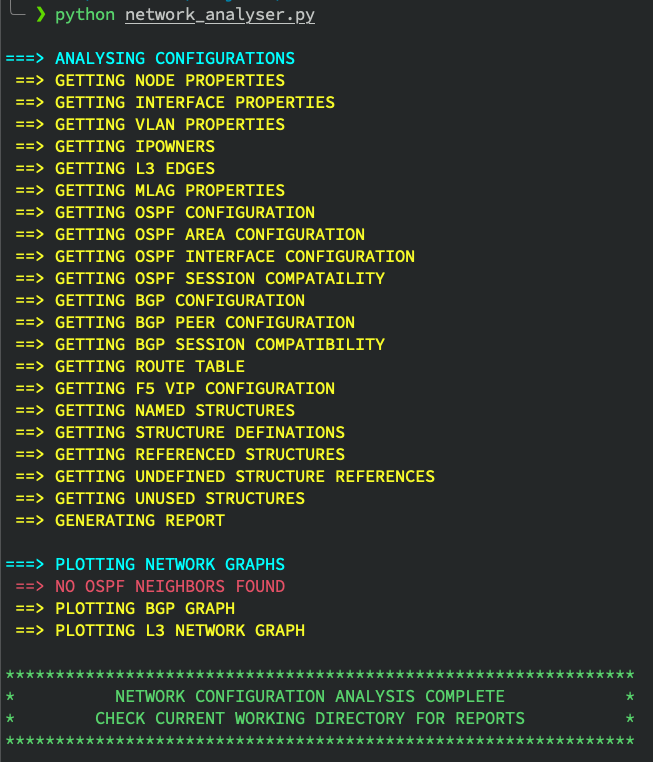
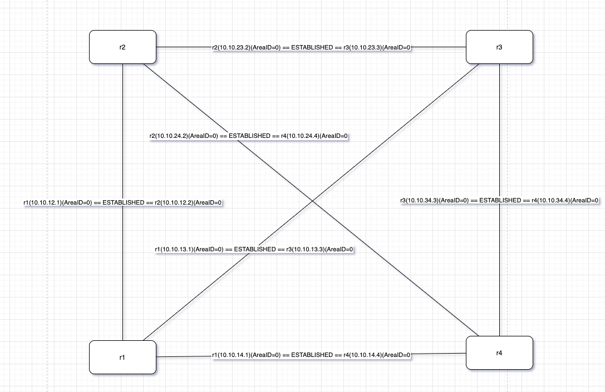

[](https://www.python.org/downloads/)

# Network Analyser
This tool analysis network configuration to generate an analysis report and network graph.
It utilises `batfish` as its analyser engine and `N2G` to plot network graphs.

The following are captured in the generated analysis reports.
* Node Properties
* Interface Properties
* VLAN Properties
* IP Owners
* Layer3 Edges
* MLAG Properties
* OSPF Configuration
* OSPF Interface Configuration
* OSPF Session Compatability
* BGP Configuration
* BGP Peer Configuration
* BGP Session Compatability
* Routing Table
* F5 VIP Configuration
* Named Structures
* Structure Definations
* References Structures
* Undefined Structure References
* Unused Structures

The following network graphs are generated that can be viewed in draw.io in a web browser.
* OSPF Graph
* BGP Graph
* L3 Network Graph

## Requirements
This script uses batfish as the analysis engine and required the batfish docker.
Please follow the below steps to full the latest image of batfish docker and run it.

```
docker pull batfish/allinone
docker run --name batfish -v batfish-data:/data -p 8888:8888 -p 9997:9997 -p 9996:9996 batfish/allinone
```

Install required python packages as captured in the requirements.txt(requirements.txt) file.
```
pip install -r requirements.txt
```
Note:- It is highly recommended that you create a new python virtual environment(for your own sanity(trust me)) 

## Executing the script
Execute the following command to execute the script.
```
python network-analyser.py
```

## Sample Output

### Script Execution


### Generated Graph
After slight editing, the graph will look like this.
